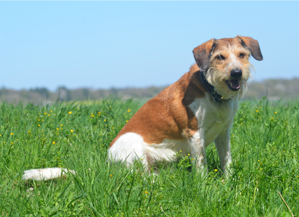

# Convolutional_Autoencoder
Convolutional Auto-encoder trained on MSCOCO + Flickr 30k. Total ~ 200k images  
The model works with both `jpg` and `png` images.

To retrain the model: `python3 train_encoder.py`  
If you want to retrain the model, do not forget to put your images in `0` folder in `images`.   

To evaluate the model: `python3 evaluate.py <checkpoints/checkpointname> <path_to_image>`   
If you clone this repo, put `model.h5` instead of `checkpoint_name`  
The output image by default will have `jpg` extension. You can change that in `evaluate.py`  

JPG image example: 
 
   

PNG image example: 
 
 

**References:**  
[Original Github repo](https://github.com/OliverEdholm/Convolutional-Autoencoder) 
